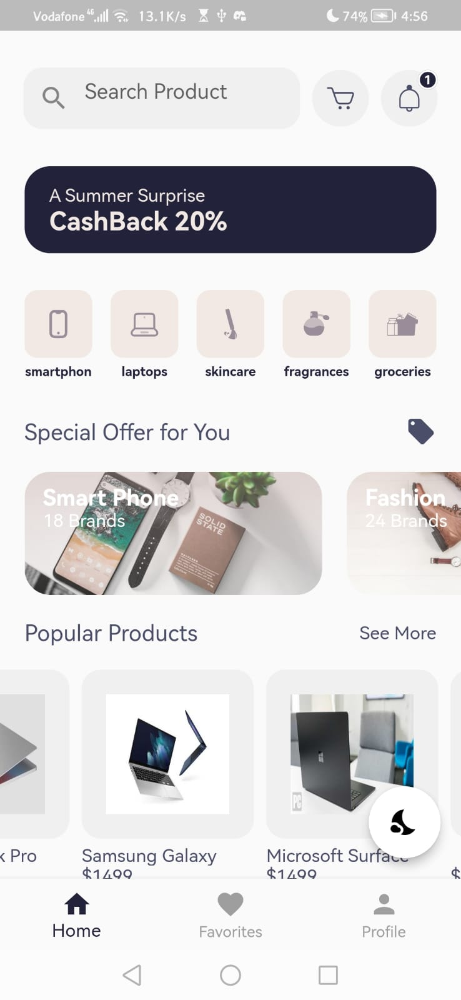
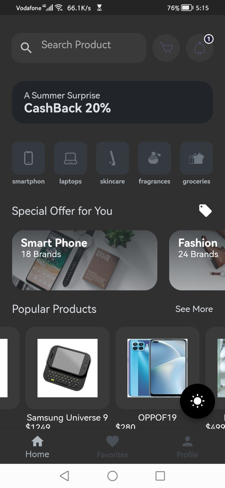
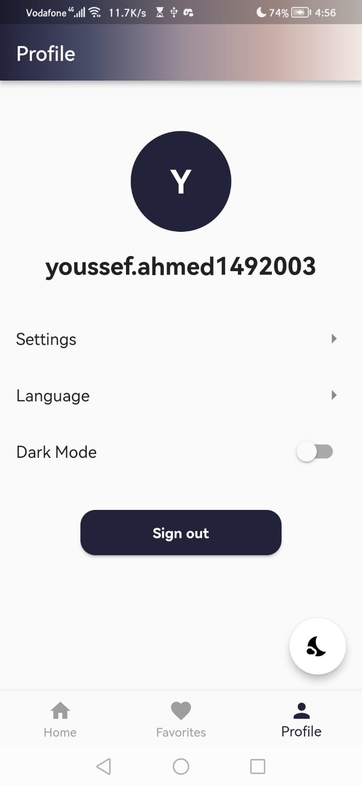
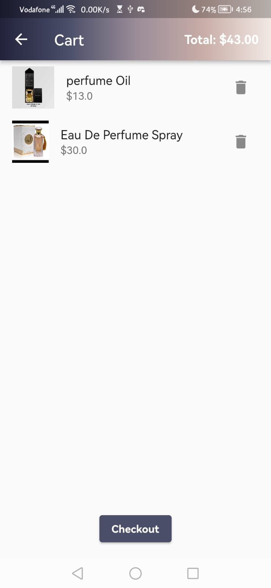

# E-Commerce Flutter App

A mobile e-commerce application built using Flutter, designed to provide a seamless shopping experience for users.


## Table of Contents

- [Introduction](#introduction)
- [Features](#features)
- [Getting Started](#getting-started)
  - [Prerequisites](#prerequisites)
  - [Installation](#installation)
- [Screenshots](#screenshots)


## Introduction

This Flutter app is designed to offer users a user-friendly and feature-rich e-commerce experience. It includes essential e-commerce functionalities such as browsing products, adding them to the cart, managing the cart

## Features

- Browse products by category.
- Search for specific products.
- View detailed product information.
- Add products to the shopping cart.
- Manage items in the shopping cart.
- User authentication and profile management.
- Product reviews and ratings.
- Wishlist functionality.
- Responsive design for various screen sizes.
- **API Integration:** Fetch real-time product data from external APIs.
- **Firebase Integration:** Store user data, order history, and more in the cloud.
- **Authentication:** Users can log in using Google accounts.
- **Dark Theme:** Switch between light and dark modes for better user experience.

## Screenshots







## Getting Started

Follow these steps to get a copy of the project up and running on your local machine.

### Prerequisites

Before you begin, ensure you have met the following requirements:

- [Flutter Installation Guide](https://flutter.dev/docs/get-started/install)
- [Dart Installation Guide](https://dart.dev/get-dart)

### Installation

1. Clone the repository:

   ```bash
   git clone https://github.com/farahmoataz90/E-Commerce_FlutterApp.git
